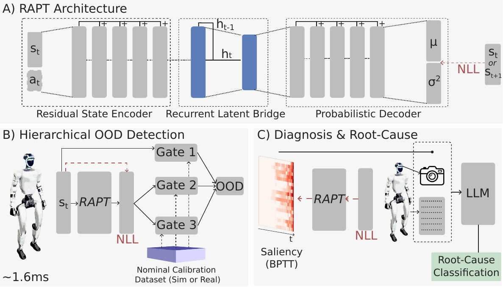
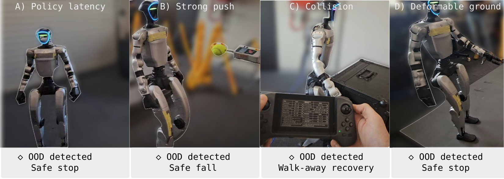

# RAPT — Model-Predictive OOD Detection and Failure Diagnosis

Code release for **"RAPT: Model-Predictive Out-of-Distribution Detection and
Failure Diagnosis for Sim-to-Real Humanoid Deployment"**
([arXiv:2602.01515](https://arxiv.org/abs/2602.01515)).

[**Project page**](https://humphreymunn.github.io/RAPT/) ·
[**Paper**](https://arxiv.org/abs/2602.01515) ·
[**Video**](https://www.youtube.com/watch?v=nAW1QfHK9ic) ·
[**Dataset**](https://huggingface.co/datasets/hmunn/rapt-g1-ood)

RAPT is a lightweight self-supervised runtime monitor for learned controllers.
A probabilistic recurrent trajectory model (residual state encoder → GRU
latent bridge → bottleneck → diagonal-Gaussian decoder) is trained on nominal
trajectories with a heteroscedastic NLL loss; at deployment its per-dimension
prediction error feeds three calibrated statistical gates that flag
out-of-distribution behavior in **~1.6 ms per 50 Hz control step**. On
detection, integrated gradients through time localize *which* input
dimensions and *when* they drove the anomaly, and a multimodal LLM classifies
the physical root cause from a fixed failure taxonomy.

<p align="center">
  
</p>

On the paper's benchmarks (four Unitree G1 tasks in Isaac Lab + 78 real-robot
runs): **0.92 AUROC** in simulation (+37% TPR over the strongest baseline at
0.5% FPR), **56/63 anomalies detected on real hardware with a single false
positive in over an hour of nominal operation**, and **87.5% top-1 / 100%
top-3** root-cause classification accuracy with a visual keyframe.

<p align="center">
  
</p>

Although developed for humanoid sim-to-real transfer, the pipeline is
signal-agnostic: it trains on any dataset of multivariate time-series
sequences `[N × T_i × D]` (variable length) — proprioception, tabular sensor
streams, or a learned latent space.

## Install

```bash
git clone <this repo> && cd RAPT
pip install -e .            # numpy, torch, scikit-learn, matplotlib, pyyaml, tqdm
pip install -e ".[onnx]"    # + onnx, onnxruntime (deployment/export)
pip install -e ".[llm]"     # + anthropic, openai (automatic diagnosis)
```

Or, with [pixi](https://pixi.sh) (optional — reproducible conda-forge
environment, no system Python needed):

```bash
pixi install                # default env; or: pixi install -e full  (onnx + llm)
pixi run quickstart         # tasks: quickstart / make-data / train / evaluate
pixi shell                  # drop into the environment
```

## Quickstart (2 minutes, synthetic data)

```bash
python scripts/make_synthetic_data.py --out data/sample     # already bundled
python scripts/train.py data/sample/train.npz --out checkpoints/quickstart
python scripts/evaluate.py checkpoints/quickstart data/sample/eval.npz
python scripts/detect.py    checkpoints/quickstart data/sample/eval.npz --index 1
python scripts/attribute.py checkpoints/quickstart data/sample/eval.npz --index 1
python scripts/diagnose.py  checkpoints/quickstart data/sample/eval.npz --index 1
```

`train.py` prints train/val NLL per epoch, reports held-out test NLL,
calibrates the detection gates, and writes a complete checkpoint (PyTorch +
ONNX + normalization stats + thresholds). `evaluate.py` reports the paper's
metrics (AUROC, Safety Score = TPR @ 0.5% episode FPR, PADD, confusion
counts). Or run it all in one script: `python examples/quickstart.py`.

## 1. Train RAPT on your own data

**Data format** — N sequences, each `[T_i, D]` (T may vary). Accepted on
disk (see `rapt/data.py` for details): a single `.npz` (ragged `seq_00000…`
keys or a dense `[N,T,D]` array, optional `actions`, `labels`, `dim_names`),
an `.h5` with `observations`/`actions`, or a directory of per-sequence
`.csv`/`.npy` files (CSV headers become dimension names, `labels.json` /
`dim_names.json` honored).

```bash
python scripts/train.py my_data/ --out checkpoints/mine \
    --dim-names labels.json          # optional: name the D dimensions
python scripts/train.py my_data/ --out checkpoints/mine --dynamics
    # forward-dynamics target (predict o_{t+1} from (o_t, a_t)); needs actions;
    # best for command-conditioned locomotion (paper ablation)
```

Everything is also available as a library:

```python
from rapt import RaptConfig, RaptSystem, load_sequences, train_rapt

data = load_sequences("my_data/")
train, val, test = data.nominal().split()
cfg = RaptConfig(obs_dim=data.obs_dim, dim_names=data.dim_names)
model, stats, history = train_rapt(cfg, train, val)
system = RaptSystem(cfg, model, stats, history=history)
system.calibrate(val)
system.save("checkpoints/mine")

result = system.detector().step(obs_t)        # streaming detection
saliency = system.attribute(obs_history)      # root-cause attribution
```

**Root-cause attribution** (`scripts/attribute.py`) needs a temporal window
before the detection point — the paper uses 200 steps (4 s at 50 Hz);
attribution over much shorter histories is unreliable. It reports the top-K
salient dimensions (by name, if labeled) with saliency-onset times and saves
the spatio-temporal heatmap.

**LLM diagnosis** (`scripts/diagnose.py`) renders the evidence images
(saliency heatmap, raw-signal history, optional command history and camera
keyframe) and queries an LLM to rank the top-3 root causes. Plug in your
API — `--provider anthropic` or `--provider openai`, any model via
`--model`, or `--provider none` to get `prompt.txt` + images for any other
LLM (the `rapt.diagnosis.diagnose()` API accepts an arbitrary callable).
The paper's 21-class humanoid failure taxonomy is the default; supply your
own classes with `--taxonomy my_classes.json`, and the responses are parsed
into ranked `(category, name)` pairs automatically.

## Datasets

Labeled G1 simulation benchmarks (nominal `train.npz` + per-category OOD
`test.npz` per task) are on HuggingFace:
[`hmunn/rapt-g1-ood`](https://huggingface.co/datasets/hmunn/rapt-g1-ood).

```bash
pip install huggingface_hub
python - <<'PY'
from huggingface_hub import snapshot_download
print(snapshot_download("hmunn/rapt-g1-ood", repo_type="dataset",
                        local_dir="datasets/g1"))
PY
python scripts/benchmark.py datasets/g1/g1_velocity datasets/g1/g1_mimic_* --out results
```

`benchmark.py` trains, calibrates, and evaluates RAPT on each task and saves
per-task `metrics.json` (AUROC, Safety Score, confusion counts, PADD,
per-fault detection rates) plus a `summary.md` table;
`scripts/evaluate_paper.py` instead reproduces the paper's simulation
evaluation protocol (model gates only, per-category TPR @ 0.5% FPR).
Reference numbers for both live on the dataset card. The datasets were
collected with `reproduce/isaaclab/collect_rapt_datasets.py` (expert-policy
rollouts in Isaac Lab; observation-level and physics-level OOD injections
with the paper's sampling ranges).

Each task ships two nominal training splits — `train.npz` (~1.2M steps,
the paper's training scale) and `train_small.npz` (~300k steps) — so you
can study detection under **limited nominal data**: cheap to gather in
simulation, but scarce and expensive to verify on real systems, which is
the regime most OOD deployments actually face. In our single-seed reference
runs the 4x larger split lifts both AUROC and low-FPR sensitivity on every
task (e.g. velocity 0.891 → 0.911 AUROC, Safety Score 0.57 → 0.70); the
full table and evaluation-protocol notes live on the
[dataset card](https://huggingface.co/datasets/hmunn/rapt-g1-ood).

## 2. Reproduce the paper

See [`reproduce/`](reproduce/README.md):

- `reproduce/baselines/` + `run_baselines.py` — LSTM-VAE, Deep SVDD, and
  Isolation Forest with the paper's hyperparameters, on the common data
  format (PatchAD via its official repo; config documented).
- `reproduce/ood_injection.py` — the paper's observation-space OOD
  categories for building labeled eval sets from nominal data.
- `reproduce/isaaclab/` — the original Isaac Lab experiment scripts
  (data collection from expert policies, the 4096-env evaluation with all 14
  OOD injection categories, the Taguchi L12 ablation over 48 models).
- `reproduce/realworld/` — the original evaluation scripts for the 78
  real-robot G1 runs.

## 3. Deploy and calibrate

See [`deploy/`](deploy/README.md) — the checkpoint directory is the unit of
deployment (ONNX graph + stats + thresholds, plus flat CSV twins so the C++
runtime needs no JSON/HDF5 libraries):

- **Python**: `deploy/python/rapt_monitor.py` — onnxruntime + numpy only;
  `RaptMonitor(ckpt).step(obs, action)` per control tick (~0.5 ms/step).
- **C++**: `deploy/cpp/rapt_monitor.hpp` — single self-contained header
  against onnxruntime; `deploy/cpp/main.cpp` + CMake build a log-replay
  example. The original on-robot Unitree G1 integration header ships as
  reference.
- **Calibration**: record a brief verified nominal run on *your* system
  (the paper used 3×1 min), then
  `python scripts/calibrate.py <ckpt> <nominal-logs>` — this absorbs static
  sim-to-real offsets (sensor noise, latency, contact/hardware dynamics).
  Robot-side CSV logs convert via `scripts/import_deploy_logs.py`.
- **Pretrained**: `checkpoints/g1_29dof_velocity/` is the paper's G1 29-DoF
  velocity-tracking forward-dynamics model (96 obs dims + 29 actions, named
  dimensions, sim calibration included — recalibrate on your own nominal
  data before real deployment). Legacy paper-era model directories convert
  with `scripts/convert_legacy_checkpoint.py`.

## Repository layout

```
rapt/                core library: data, model, training, gates, saliency, LLM diagnosis
scripts/             CLI: train / evaluate / calibrate / detect / attribute / diagnose /
                     export_onnx / import_deploy_logs / convert_legacy_checkpoint
reproduce/           paper baselines + OOD injection + original experiment scripts
deploy/              Python + C++ runtime monitors, calibration workflow
checkpoints/         pretrained G1 velocity checkpoint
examples/            end-to-end quickstart
data/sample/         bundled synthetic dataset
```

## Citation

```bibtex
@article{munn2026rapt,
  title   = {RAPT: Model-Predictive Out-of-Distribution Detection and Failure
             Diagnosis for Sim-to-Real Humanoid Deployment},
  author  = {Munn, Humphrey and Tidd, Brendan and B{\"o}hm, Peter and
             Gallagher, Marcus and Howard, David},
  journal = {arXiv preprint arXiv:2602.01515},
  year    = {2026}
}
```

## License

[BSD 3-Clause](LICENSE). RAPT is a monitoring/debugging aid, not a certified
safety system — detections should gate conservative fallback behaviors, not
replace them.
